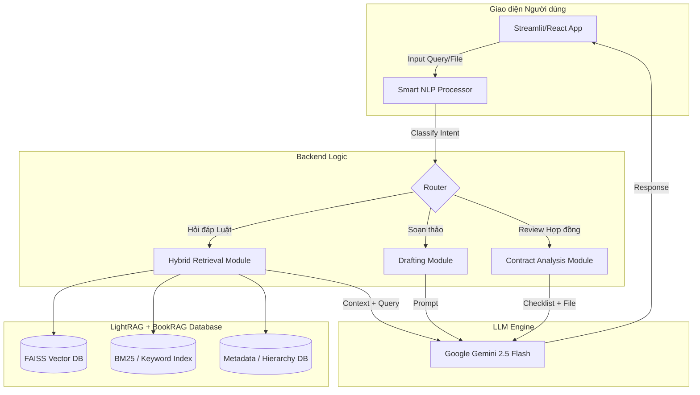
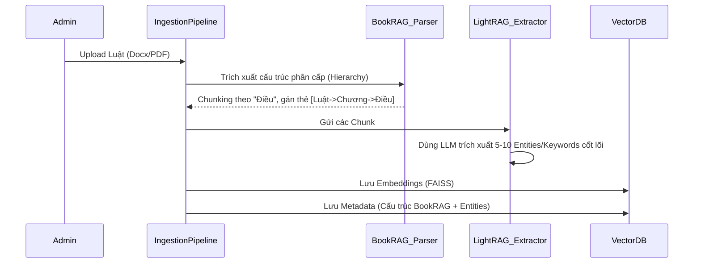
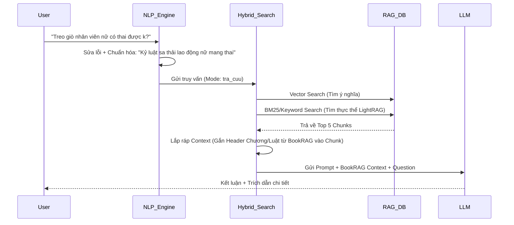
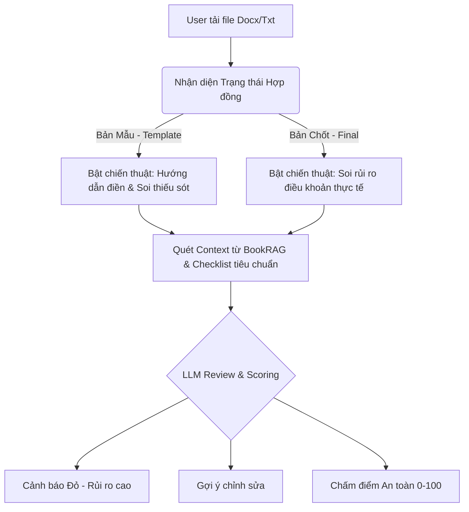
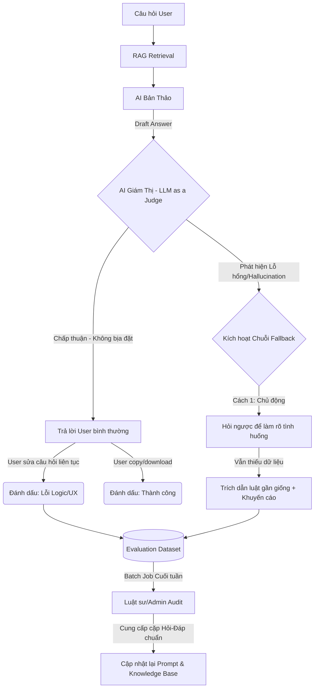

# ⚖️ Tài liệu Yêu cầu Sản phẩm (PRD): AI Legal Assistant cho SME

> [!NOTE]
> **Dự án:** AI Legal Assistant (Trợ lý Pháp lý AI)
> **Đối tượng mục tiêu:** Doanh nghiệp Vừa và Nhỏ (SME) tại Việt Nam
> **Kiến trúc Lõi:** LightRAG kết hợp BookRAG (Cấu trúc phân cấp + Đồ thị thực thể nhẹ)
> **Phiên bản:** 1.0

---

## 1. Tổng quan Dự án (Project Overview)

### 1.1 Mục tiêu (Objective)
Xây dựng một Trợ lý ảo AI nội bộ giúp nhân viên của các doanh nghiệp SME (đặc biệt là phòng Kế toán, Nhân sự, Sales) tự động tra cứu quy định pháp luật chính xác, soạn thảo biểu mẫu và thẩm định rủi ro hợp đồng cơ bản một cách nhanh chóng, chi phí thấp mà không cần kiến thức chuyên sâu về luật.

### 1.2 Vấn đề của SME (Problem Statement)
- **Chi phí luật sư cao:** SME không có khả năng thuê luật sư in-house hoặc dịch vụ tư vấn luật thường xuyên cho các vấn đề vận hành hằng ngày.
- **Rủi ro hợp đồng:** Nhân viên thường dùng Google tải các "hợp đồng mẫu" lỏng lẻo, lỗi thời dẫn đến rủi ro tranh chấp, phạt vi phạm.
- **Mất thời gian tra cứu:** Việc tìm kiếm đúng Điều/Khoản luật áp dụng trong ma trận pháp luật Việt Nam vô cùng tốn thời gian.

### 1.3 Giải pháp: Kiến trúc LightRAG + BookRAG
Thay vì dùng GraphRAG đồ sộ tốn kém, giải pháp sử dụng **BookRAG** để giữ nguyên cấu trúc Chương/Điều của Luật, kết hợp **LightRAG** (trích xuất từ khóa/thực thể nhẹ) để đảm bảo:
1. **Rẻ:** Chi phí vận hành LLM thấp (sử dụng Gemini Flash).
2. **Nhanh:** Tốc độ phản hồi dưới 3 giây.
3. **Chính xác:** Trích xuất luật kèm đầy đủ ngữ cảnh (Luật -> Chương -> Điều -> Khoản).

---

## 2. Kiến trúc Hệ thống & Workflow (Architecture)

### 2.1 Kiến trúc Tổng thể (High-level Architecture)

### 2.2 Workflow 1: Luồng nạp dữ liệu (Data Ingestion Workflow)
Đây là quy trình biến các file Word văn bản luật thành cơ sở dữ liệu tri thức theo chuẩn `LightRAG + BookRAG`.

> [!TIP]
> **BookRAG Parsing:** Khi cắt Chunk "Điều 15", hệ thống phải tự động dán nhãn Metadata: `Luật Đầu Tư 2020 | Chương 2`. Khi lấy Chunk này để hỏi AI, AI sẽ không bị mất bối cảnh vĩ mô.

### 2.3 Workflow 2: Luồng Tra cứu & Hỏi đáp (Query Workflow)

### 2.4 Workflow 3: Luồng Thẩm định Hợp đồng (Contract Review)

### 2.5 Workflow 4: Self-Correction & Feedback Harness (Luồng Tự Hiệu Chỉnh)

Hệ thống thiết kế theo hướng Zero-Feedback Self-Correction (Không phụ thuộc vào trình độ luật của User). AI sẽ tự kiểm duyệt chéo và học hỏi qua các hành vi ngầm.

---

## 3. Tính năng Cốt lõi (Core Features)

### 3.1. Smart NLP Front-Desk (Lễ tân AI)
- **Tự động sửa lỗi:** Nhận diện và sửa lỗi teencode, viết tắt (VD: "hđ" -> "hợp đồng", "k" -> "không") để tăng độ chuẩn xác khi search FAISS.
- **Phân loại Ý định (Intent Router):** Tự động bẻ lái yêu cầu vào 1 trong 4 luồng: Tra cứu Luật, Soạn thảo, Thẩm định File, Chat thông thường.
- **Cơ chế Fallback Thông minh (Zero-Hallucination UX):** Tích hợp AI Giám thị (Judge) ngầm. Khi phát hiện rủi ro bịa đặt luật, hệ thống KHÔNG báo lỗi "Tôi không biết" mà chuyển sang chuỗi dự phòng:
  1. **Hỏi ngược (Guided Discovery):** Yêu cầu User cung cấp thêm các tình tiết phụ để làm hẹp phạm vi tìm kiếm.
  2. **Trích dẫn thụ động:** Nếu đã làm rõ mà RAG nội bộ vẫn không có kết quả chính xác 100%, hệ thống tự động cung cấp các điều luật "gần đúng nhất" kèm theo khuyến cáo để User tự đánh giá, tuyệt đối không đưa ra kết luận chốt hạ.

### 3.2. Hybrid RAG Search (Dựa trên LightRAG + BookRAG)
- **BookRAG Context:** Khi trích xuất một Điều luật cho người dùng, hệ thống luôn báo cáo rõ Điều đó thuộc Chương nào, Bộ Luật nào, Năm bao nhiêu để đảm bảo tính pháp lý.
- **Bộ lọc Pháp lý (Year Filtering):** Tự động bỏ qua các luật cũ (VD: Bỏ Luật Doanh nghiệp 2014 nếu đã tìm thấy quy định tương tự ở bản 2020).

### 3.3. Thẩm định Hợp đồng Động (Dynamic Contract Review)
- Nhận diện Hợp đồng Mẫu vs Hợp đồng Chốt.
- Phân tích rủi ro dựa trên bộ Tiêu chuẩn (Checklist) của doanh nghiệp.
- **An toàn Dữ liệu:** Tự động che thông tin (Redact PII) như số điện thoại, CCCD, Email trước khi đẩy lên LLM. Xóa file ngay sau khi review.

---

## 4. Yêu cầu Phi chức năng (Non-Functional Requirements)

> [!IMPORTANT]
> - **Hiệu năng (Performance):** Tra cứu luật < 3 giây. Phân tích hợp đồng dài (20 trang) < 15 giây.
> - **Chi phí (Cost):** Tối ưu hóa việc gọi API. Dùng `gemini-2.5-flash` cho các tác vụ routing và hỏi đáp nhanh. Tránh gọi các mô hình quá lớn trừ tác vụ đặc biệt.
> - **Bảo mật:** Toàn bộ dữ liệu Hợp đồng phải bị xóa khỏi server (Thư mục `temp_uploads`) ngay sau khi phiên làm việc kết thúc hoặc người dùng bấm "Xóa đoạn chat". Mã nguồn UI Frontend không được chứa API Key tĩnh.

---

## 5. Lộ trình Triển khai (Roadmap)

### Phase 1: Nền tảng (Hoàn thiện BookRAG & UI) - Tuần 1-2
- Cấu trúc lại hàm `chunk_text` để thu thập Metadata phân cấp (Hierarchy: Luật -> Chương -> Điều).
- Xóa bỏ điểm yếu gọi thẳng API từ React (nếu tiếp tục dùng React) bằng cách dựng API Middleware backend.
- Hoàn thiện tính năng Tra cứu luật cơ bản (Chưa có Keyword search).

### Phase 2: Đưa vào LightRAG (Hybrid Search) - Tuần 3-4
- Tích hợp `rank_bm25` và PyVi/Underthesea để phân tách từ tiếng Việt.
- Bổ sung trường "Entities" vào Metadata lúc lập Index.
- Thiết lập cơ chế Ensemble (Chấm điểm kết hợp Vector + Keyword) khi truy vấn.

### Phase 3: Tối ưu Thẩm định & Triển khai - Tuần 5-6
- Tinh chỉnh Prompt cho tính năng Review Hợp đồng (Phân định rõ Rủi ro Pháp lý vs Rủi ro Thương mại).
- Đóng gói Docker, triển khai thử nghiệm (UAT) cho 1-2 phòng ban (Kế toán/HR).
