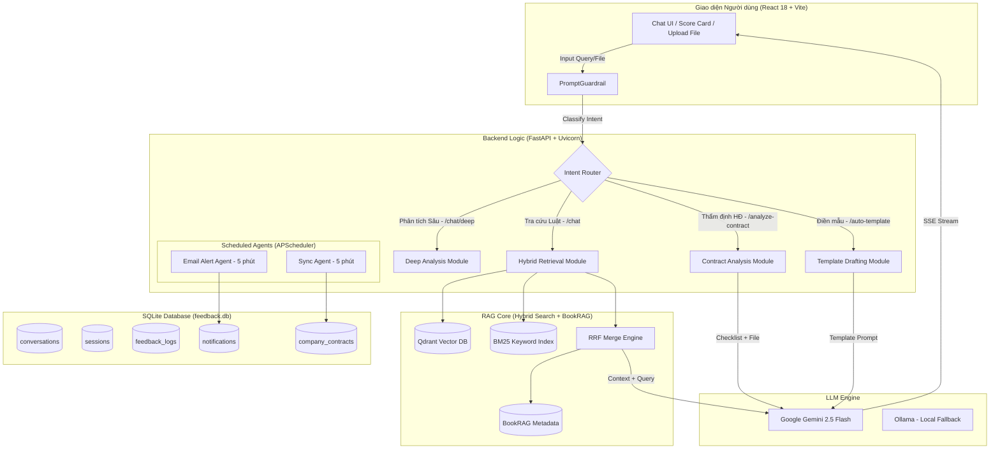
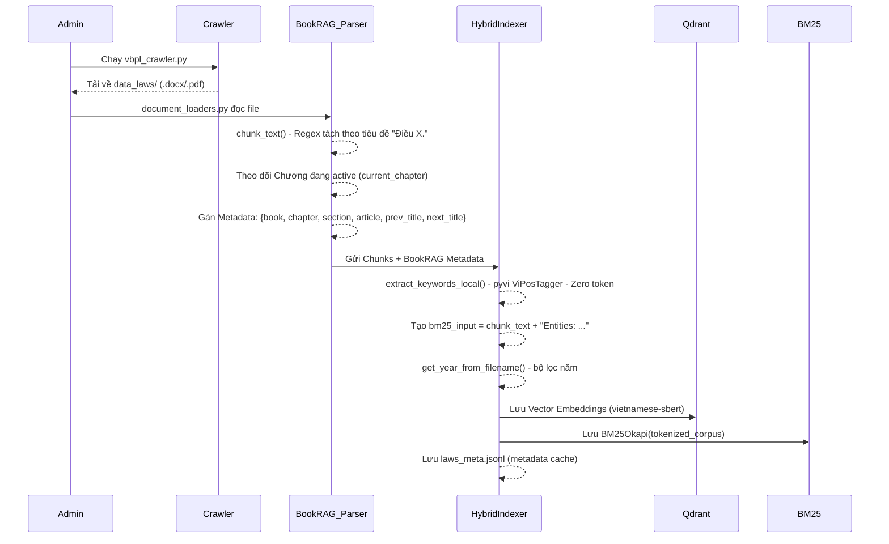
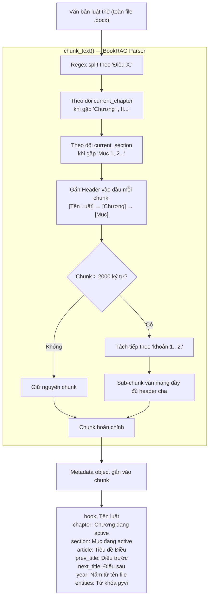
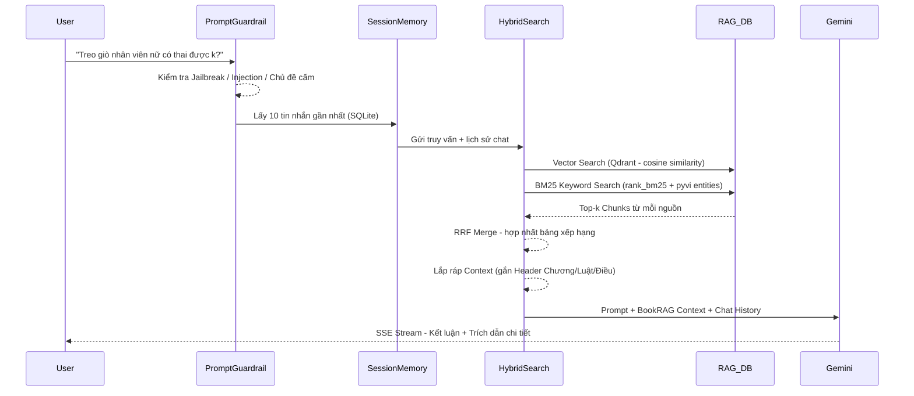
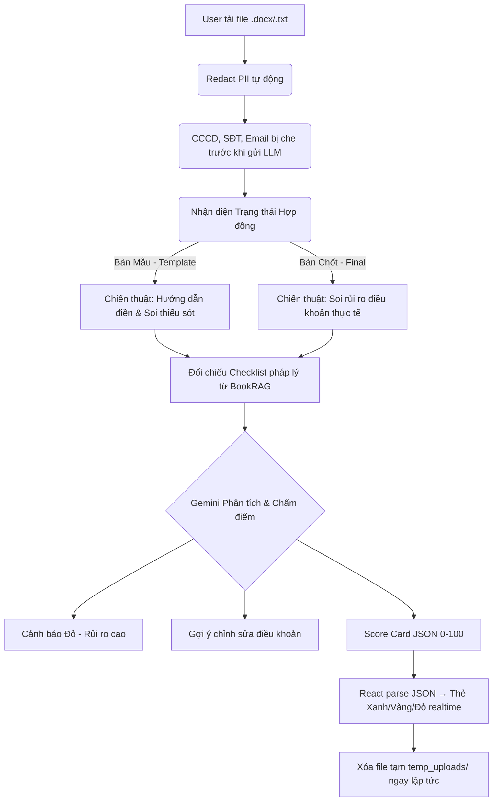
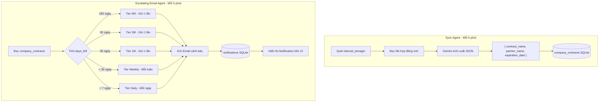
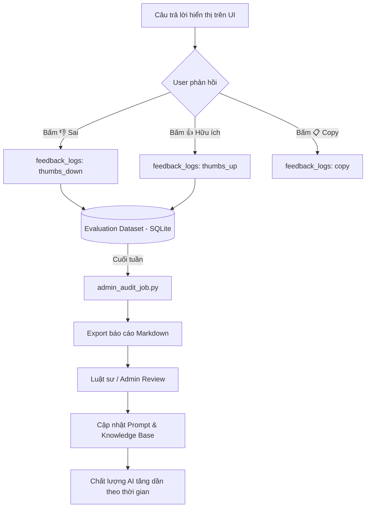

# ⚖️ Tài liệu Yêu cầu Sản phẩm (PRD): AI Legal Assistant cho SME

> [!NOTE]
> **Dự án:** AI Legal Assistant (Trợ lý Pháp lý AI)
> **Đối tượng mục tiêu:** Doanh nghiệp Vừa và Nhỏ (SME) tại Việt Nam
> **Kiến trúc Lõi:** Hybrid RAG (Vietnamese SBERT + BM25 + RRF) trên Qdrant Vector DB
> **Phiên bản:** 2.0 — Cập nhật theo kiến trúc thực tế đã triển khai

---

## 1. Tổng quan Dự án (Project Overview)

### 1.1 Mục tiêu (Objective)
Xây dựng một Trợ lý ảo AI nội bộ giúp nhân viên của các doanh nghiệp SME (đặc biệt là phòng Kế toán, Nhân sự, Sales) tự động tra cứu quy định pháp luật chính xác, soạn thảo biểu mẫu và thẩm định rủi ro hợp đồng cơ bản một cách nhanh chóng, chi phí thấp mà không cần kiến thức chuyên sâu về luật.

### 1.2 Vấn đề của SME (Problem Statement)
- **Chi phí luật sư cao:** SME không có khả năng thuê luật sư in-house hoặc dịch vụ tư vấn luật thường xuyên cho các vấn đề vận hành hằng ngày.
- **Rủi ro hợp đồng:** Nhân viên thường dùng Google tải các "hợp đồng mẫu" lỏng lẻo, lỗi thời dẫn đến rủi ro tranh chấp, phạt vi phạm.
- **Mất thời gian tra cứu:** Việc tìm kiếm đúng Điều/Khoản luật áp dụng trong ma trận pháp luật Việt Nam vô cùng tốn thời gian.

### 1.3 Giải pháp: Kiến trúc Hybrid RAG + BookRAG
Thay vì dùng GraphRAG đồ sộ tốn kém, giải pháp sử dụng **BookRAG** để giữ nguyên cấu trúc Chương/Điều của Luật, kết hợp **Hybrid Search** (Vector + BM25 + RRF) để đảm bảo:
1. **Rẻ:** Chi phí vận hành LLM thấp (dùng Gemini 2.5 Flash). Embedding và BM25 chạy local miễn phí.
2. **Nhanh:** Tốc độ phản hồi dưới 3 giây nhờ SSE Streaming.
3. **Chính xác:** Trích xuất luật kèm đầy đủ ngữ cảnh (Luật → Chương → Điều → Khoản), ưu tiên văn bản luật mới nhất.

#### BookRAG — Chiến lược Chunking theo Cấu trúc Pháp lý

RAG thông thường cắt văn bản theo **số ký tự cố định** (500 tokens) — điều này rất nguy hiểm với văn bản luật vì một "Điều" có thể bị cắt đứt giữa chừng, hoặc AI nhận được nội dung "Khoản 3" nhưng không biết đang nói về "Điều" nào, "Chương" nào.

**BookRAG giải quyết bằng cách chunking theo đúng cấu trúc phân cấp của văn bản pháp luật:**

```
Cấp 1 — Văn bản: Bộ Luật Lao Động 2019
  └─ Cấp 2 — Chương: Chương III. HỢP ĐỒNG LAO ĐỘNG
       └─ Cấp 3 — Mục: Mục 2. Thực hiện hợp đồng
            └─ Cấp 4 — Điều: Điều 35. Chấm dứt hợp đồng lao động  ← ĐƠN VỊ CHUNK
                   └─ Cấp 5 — Khoản: 1., 2., 3.  ← Sub-chunk nếu Điều quá dài (>2000 ký tự)
```

Cụ thể `chunk_text()` hoạt động như sau:
- **Regex tách theo `Điều X.`** — mỗi Điều là một chunk độc lập.
- **Theo dõi `current_chapter`** — hệ thống quét ngược văn bản phía trước mỗi Điều để tìm tiêu đề Chương đang active.
- **Theo dõi `current_section`** — tương tự với tiêu đề Mục.
- **Nhúng header vào nội dung chunk** — mỗi chunk bắt đầu bằng dòng `[Tên Luật] → [Chương] → [Mục]` để LLM luôn biết ngữ cảnh macro.
- **Ghi nhớ Điều liền kề** — lưu `prev_title` (Điều trước) và `next_title` (Điều sau) để AI có thể gợi ý người dùng xem thêm các điều liên quan.
- **Tách Khoản nếu Điều dài > 2000 ký tự** — mỗi sub-chunk vẫn mang đầy đủ header cha, không bao giờ bị mất gốc.

**Kết quả:** Dù AI chỉ "nhìn thấy" một đoạn nhỏ (Khoản 1 Điều 35), nó vẫn biết đây là **Bộ Luật Lao Động 2019, Chương III, Mục 2** — và trả lời có trích dẫn đầy đủ.

---

## 2. Kiến trúc Hệ thống & Workflow (Architecture)

### 2.1 Kiến trúc Tổng thể (High-level Architecture)



### 2.2 Workflow 1: Luồng nạp dữ liệu (Data Ingestion Workflow)
Quy trình biến văn bản luật thành cơ sở tri thức theo chuẩn **BookRAG + Hybrid Index**.



### 2.2b Cách triển khai BookRAG (BookRAG Implementation Detail)

BookRAG là kỹ thuật cốt lõi giúp AI không bao giờ mất ngữ cảnh khi trả lời. Cụ thể được cài đặt trong `chunk_text()` tại `utils/text_processing.py`:



> [!TIP]
> **Ví dụ thực tế:** Khi cắt "Điều 35. Chấm dứt hợp đồng lao động", hệ thống tự động nhúng header:
> ```
> [bo-luat-lao-dong-2019] → [Chương III. HỢP ĐỒNG LAO ĐỘNG] → [Mục 2. Thực hiện]
> Điều 35. Chấm dứt hợp đồng lao động
> 1. Người lao động có quyền đơn phương chấm dứt...
> (Liên quan: Điều 34. Sửa đổi HĐ | Điều 36. Bồi thường)
> ```
> Khi LLM nhận được chunk này, nó biết ngay đây là Bộ Luật Lao Động 2019, không cần đoán.

> [!NOTE]
> **Bộ lọc pháp lý (Year Filtering):** Hàm `get_year_from_filename()` trích xuất năm từ tên file (`bo-luat-lao-dong-**2019**-qh.docx`). Khi tìm kiếm, nếu tồn tại hai văn bản cùng `law_base` (ví dụ: luật lao động), hệ thống **tự động loại bỏ** bản cũ hơn và chỉ giữ bản mới nhất trong kết quả trả về.

### 2.3 Workflow 2: Luồng Tra cứu & Hỏi đáp (Query Workflow)



### 2.4 Workflow 3: Luồng Thẩm định Hợp đồng (Contract Review)



### 2.5 Workflow 4: Giám sát Hợp đồng Nội bộ (Scheduled Agents)



### 2.6 Workflow 5: Feedback Loop & Tự Cải tiến



---

## 3. Tính năng Cốt lõi (Core Features)

### 3.1. Guardrails Bảo mật 3 Lớp (Chạy 100% Offline)
- **PromptGuardrail:** Regex pattern quét Jailbreak, Prompt Injection, và các chủ đề nằm ngoài phạm vi (luật hình sự cá nhân, v.v.) — từ chối ngay lập tức, không tốn token.
- **GroundingGuardrail:** Đối chiếu chéo các trích dẫn điều luật trong câu trả lời với context thực tế đã truy xuất. Phát hiện hallucination trước khi stream về UI.
- **StreamLoopGuardrail:** Phát hiện và ngắt vòng lặp vô hạn trong luồng SSE streaming.

### 3.2. Hybrid RAG Search (Vietnamese SBERT + BM25 + RRF)
- **Vietnamese SBERT:** Thay thế `all-MiniLM` (yếu tiếng Việt) bằng `keepitreal/vietnamese-sbert` — hiểu chính xác ngữ nghĩa pháp lý tiếng Việt.
- **BM25 + pyvi:** Trích xuất thực thể cục bộ (Danh từ, Động từ) không tốn token API. Tìm kiếm chính xác tuyệt đối các "Điều, Khoản" luật cụ thể.
- **RRF Merge:** Hợp nhất bảng xếp hạng từ cả Vector và Keyword, cho kết quả tốt nhất từ cả hai nguồn.
- **Bộ lọc Pháp lý (Year Filtering):** Tự động trích xuất năm từ tên file và ưu tiên văn bản luật mới nhất lên top kết quả.

### 3.3. Thẩm định Hợp đồng Động (Dynamic Contract Review)
- Nhận diện tự động Hợp đồng Mẫu vs Hợp đồng Chốt để áp dụng chiến thuật phân tích phù hợp.
- **PII Redaction:** Tự động che số CCCD, SĐT, Email trước khi đẩy lên LLM.
- **Score Card UI:** React parse JSON trong stream realtime, vẽ thẻ điểm màu Xanh/Vàng/Đỏ ngay khi AI trả lời.
- **Bảo mật Tuyệt đối:** File tạm bị xóa khỏi `temp_uploads/` ngay sau khi stream hoàn tất.

### 3.4. Soạn thảo & Điền mẫu Hợp đồng
- Thư viện template `.docx` (lao động, dịch vụ, mua bán, NDA, thuê khoán, v.v.).
- Nhận JSON context → Gemini điền thông tin → trả về file `.docx` sẵn sàng ký kết.
- Download trực tiếp qua `/download-template/{filename}` không cần API Key.

---

## 4. Yêu cầu Phi chức năng (Non-Functional Requirements)

> [!IMPORTANT]
> - **Hiệu năng (Performance):** Tra cứu luật < 3 giây. Phân tích hợp đồng dài (20 trang) < 15 giây. Đạt được nhờ SSE Streaming và Gemini 2.5 Flash.
> - **Chi phí (Cost):** Embedding chạy local (zero token). BM25 miễn phí. Chỉ gọi Gemini API khi tổng hợp câu trả lời cuối. Hỗ trợ chuyển sang Ollama local để chi phí về 0.
> - **Bảo mật:** File hợp đồng bị xóa ngay sau phiên. PII Redaction trước khi gửi LLM. API Key bắt buộc. CORS whitelist chỉ chấp nhận localhost ports.
> - **Linh hoạt LLM:** Chuyển đổi provider qua biến `LLM_PROVIDER` trong `.env`: `gemini` (cloud) · `ollama` (local, privacy-first) · `openrouter` (multi-model).

---

## 5. Lộ trình Triển khai (Roadmap)

### ✅ Phase 1: Nền tảng — Đã hoàn thành
- FastAPI backend thay thế hoàn toàn Streamlit. Uvicorn production server.
- Hybrid RAG: Vietnamese SBERT + Qdrant + BM25 + RRF.
- React/Vite frontend với SSE Streaming, Score Card UI, Session History.
- Guardrails 3 lớp chạy offline. Rate limiting. API Key auth.

### ✅ Phase 2: Tính năng Nâng cao — Đã hoàn thành
- Scheduled Agents: Sync Agent + Escalating Email Alert.
- Implicit Feedback Loop (👍/👎/📋) + SQLite feedback_logs.
- PII Redaction tự động. File cleanup sau mỗi phiên phân tích.
- Admin Audit Job (`scripts/admin_audit_job.py`) xuất báo cáo Markdown.
- Docker + docker-compose deployment.

### 🚀 Phase 3: Mở rộng — Kế hoạch tiếp theo
- Tích hợp Data Connectors bổ sung (Google Drive, SharePoint).
- Mở rộng thư viện template hợp đồng theo ngành (bất động sản, xây dựng, thương mại điện tử).
- Fine-tune prompt theo domain chuyên sâu từ feedback data tích lũy.
- Dashboard Admin UI theo dõi usage, quality metrics, và feedback trends.
